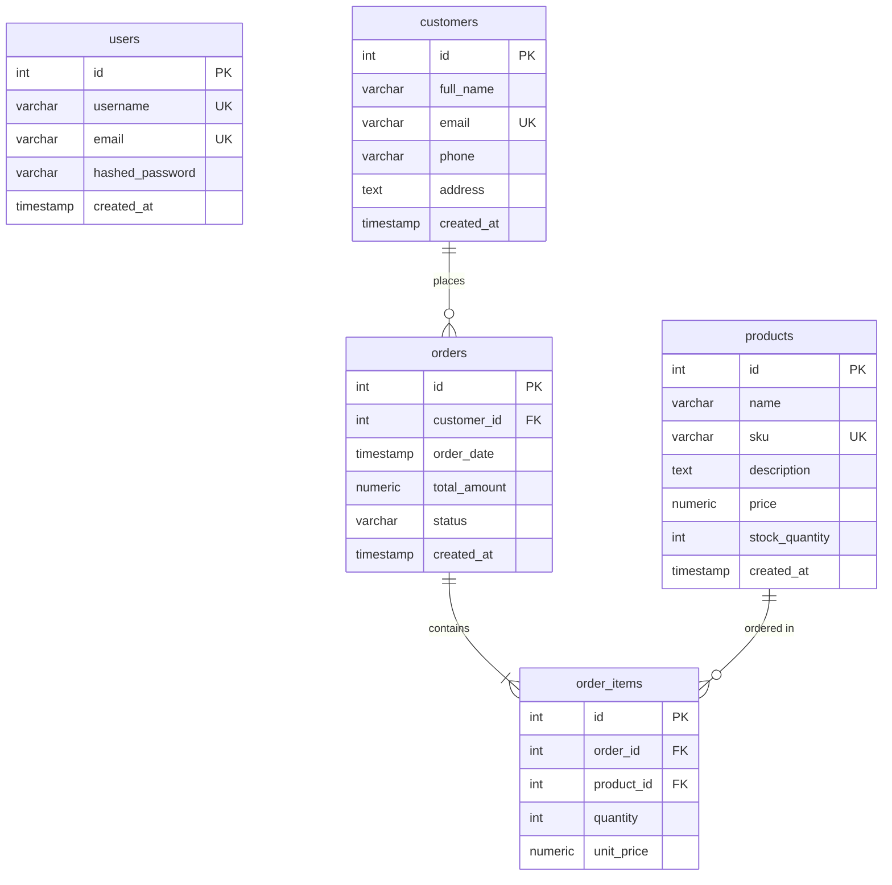

# InvenTrack - Full-Stack Inventory & Order Management System

A production-ready, high-performance Inventory and Order Management System built with a FastAPI backend, a premium Material UI React frontend, and a containerized Docker setup.

---

## 🚀 Tech Stack

### Backend
- **Python 3.11** + **FastAPI** (High performance, async ASGI framework)
- **SQLAlchemy ORM** (Async engine + session handling with PostgreSQL)
- **Pydantic v2** (Strict data validation and serialization)
- **JWT (JSON Web Tokens)** (Secure roleless authentication and session management)
- **Passlib [Bcrypt]** (Secure password hashing)

### Frontend
- **React 19** + **Vite** (Next-gen frontend build tool)
- **Material UI (MUI) v6** (Dark-mode theme, premium visual elements, custom widgets)
- **React Router v6** (Client-side routing with route protection)
- **Axios** (Configured request/response interceptors for JWT)
- **Notistack** (Premium user-facing snackbar notifications)

### Database & DevOps
- **PostgreSQL 16** (Reliable relational database storage)
- **Docker & Docker Compose** (One-click development and deployment orchestration)

---

## 📂 Project Directory Structure

```
I&OMS/
├── backend/
│   ├── app/
│   │   ├── models/           # SQLAlchemy database tables
│   │   ├── schemas/          # Pydantic validation rules
│   │   ├── routers/          # API endpoint declarations
│   │   ├── services/         # Authentication and transaction logic
│   │   ├── config.py         # App configuration settings
│   │   ├── database.py       # DB async connections and startup table creation
│   │   ├── dependencies.py   # FastAPI endpoint helpers (get_current_user)
│   │   └── main.py           # Application routing, CORS, and lifespan config
│   ├── tests/                # Automated pytest modules
│   ├── Dockerfile
│   ├── requirements.txt
│   └── .env.example
├── frontend/
│   ├── src/
│   │   ├── api/              # Axios customized instance
│   │   ├── components/       # Layouts, Sidebar, TopBar, and Confirm Dialogs
│   │   ├── context/          # React Auth Context Provider
│   │   ├── pages/            # Login, Dashboard, Products, Customers, Orders
│   │   ├── theme.js          # Material UI premium theme overrides
│   │   ├── App.jsx           # Main routing tree
│   │   └── main.jsx          # Entry point rendering App
│   ├── index.html
│   ├── nginx.conf            # Custom configuration for React Router fallback
│   ├── Dockerfile
│   ├── package.json
│   └── .env.example
├── docker-compose.yml        # Orchestration file for DB, backend, and frontend
├── .env.example              # Root environment template
└── README.md                 # Complete system guide
```

---

## 🛠️ Getting Started (Docker Compose)

### Prerequisites
Make sure you have [Docker Desktop](https://www.docker.com/products/docker-desktop/) installed on your machine.

### Quick Start
1. Clone the project and navigate to the directory:
   ```bash
   cd "c:\Users\Chatu\I&OMS"
   ```
2. Copy the environment template:
   ```bash
   cp .env.example .env
   ```
3. Run the container cluster:
   ```bash
   docker-compose up --build
   ```
4. Access the system:
   - **Frontend App**: [http://localhost](http://localhost) (mapped on Nginx)
   - **FastAPI API Docs (Swagger)**: [http://localhost:8000/docs](http://localhost:8000/docs)
   - **PostgreSQL Database**: Port `5432` on `localhost` (credentials: `postgres`/`postgres`)

---

## 💻 Local Development Setup

If you prefer to run the components locally without Docker:

### 1. Database Setup
Ensure PostgreSQL is running locally. Create a database named `inventory_db`.

### 2. Backend Server
1. Navigate to the backend directory:
   ```bash
   cd backend
   ```
2. Create a virtual environment and activate it:
   ```bash
   python -m venv venv
   # On Windows:
   .\venv\Scripts\activate
   # On macOS/Linux:
   source venv/bin/activate
   ```
3. Install dependencies:
   ```bash
   pip install -r requirements.txt
   ```
4. Copy the environment variables:
   ```bash
   cp .env.example .env
   ```
5. Run the FastAPI development server:
   ```bash
   uvicorn app.main:app --reload --port 8000
   ```

### 3. Frontend Application
1. Navigate to the frontend directory:
   ```bash
   cd ../frontend
   ```
2. Install Node.js packages:
   ```bash
   npm install
   ```
3. Copy environment variables:
   ```bash
   cp .env.example .env
   ```
4. Run Vite developer server:
   ```bash
   npm run dev
   ```
   Open [http://localhost:5173](http://localhost:5173) in your browser.

---

## 🔒 API Documentation Reference

All API routes (except authentication endpoints) require a `Bearer <JWT_TOKEN>` header.

### 👤 Authentication API
- `POST /auth/register` — Create a new administrator account
- `POST /auth/login` — Authenticate and receive a JWT token (form-data format)

### 📦 Product Management API
- `GET /products` — Get paginated list of products. Query parameters:
  - `page` (default: 1)
  - `page_size` (default: 10)
  - `search` (Search by Name or SKU)
- `GET /products/{id}` — Retrieve detailed product attributes
- `POST /products` — Create a new product (validates SKU uniqueness, price > 0, stock >= 0)
- `PUT /products/{id}` — Edit an existing product
- `DELETE /products/{id}` — Delete a product

### 👥 Customer Management API
- `GET /customers` — Get paginated list of customers. Query parameters:
  - `page` (default: 1)
  - `page_size` (default: 10)
  - `search` (Search by Name or Email)
- `GET /customers/{id}` — Retrieve customer contact/shipping details
- `POST /customers` — Create a new customer (validates Email uniqueness, correct email format)
- `PUT /customers/{id}` — Edit an existing customer details
- `DELETE /customers/{id}` — Delete a customer

### 🛒 Order Processing API
- `GET /orders` — Get paginated list of orders (includes customer details)
- `GET /orders/{id}` — Retrieve full order structure (includes customer profile, ordered products, and order item details)
- `POST /orders` — Create a new order. Core business transaction:
  1. Validates that the customer and all products exist.
  2. Evaluates stock levels for each item. If *any* product has insufficient stock, the transaction is **aborted** (raises `400 Bad Request`) and no database changes are made.
  3. Otherwise, creates the order, reduces stock levels, and computes the grand total automatically.
- `PUT /orders/{id}` — Update order status (`pending`, `confirmed`, `shipped`, `delivered`, `cancelled`)
- `DELETE /orders/{id}` — Delete order and **restore** stock quantities to products.

### 📊 System Dashboard API
- `GET /dashboard` — Retrieve aggregate metrics:
  - Total count of products
  - Total count of customers
  - Total count of orders
  - Total revenue generated
  - List of low-stock alert items (stock quantity < 10)

---

## 🛢️ PostgreSQL Database Schema



---

## 🌐 Production Deployment Guide

### Database (Neon PostgreSQL)
1. Register/Login to [Neon](https://neon.tech/).
2. Create a new Serverless Postgres project.
3. Retrieve your connection string from the dashboard. Replace the driver from `postgresql://...` to `postgresql+asyncpg://...` for your backend configuration.

### Backend (Render / Railway)
1. Log in to [Render](https://render.com/).
2. Create a new **Web Service** and link it to your GitHub Repository.
3. Configure settings:
   - **Environment**: `Python`
   - **Build Command**: `pip install -r requirements.txt`
   - **Start Command**: `uvicorn app.main:app --host 0.0.0.0 --port $PORT`
4. Set Environment Variables in Render:
   - `DATABASE_URL`: Your Neon PostgreSQL asyncpg connection string.
   - `SECRET_KEY`: A secure random password.
   - `JWT_ALGORITHM`: `HS256`
   - `ACCESS_TOKEN_EXPIRE_MINUTES`: `60`

### Frontend (Vercel / Netlify)
1. Create a new project in [Vercel](https://vercel.com/) pointing to the repository.
2. Select **Vite** as the framework preset.
3. Set the Root Directory to `frontend`.
4. Configure the Environment Variable:
   - `VITE_API_URL`: URL of your deployed backend service (e.g. `https://your-backend.onrender.com`).
5. Click **Deploy**.

---

## 🧪 Testing Manifest

Unit and API tests are built under `backend/tests` utilizing an asynchronous, in-memory SQLite database (`aiosqlite`) to keep tests completely isolated and fast.

To execute tests locally:
```bash
cd backend
pytest tests/ -v
```
Test files cover:
- **Authentication**: Registration success, duplicate email prevention, login token validation.
- **Product Constraints**: Price must be > 0 validation, SKU uniqueness validation, stock cannot be negative.
- **Customer Constraints**: Valid email format checking, email uniqueness validation.
- **Order Business Logic**: Sufficient stock validation, transactional atomic safety, automatic stock decrementing upon success, stock level restoration upon deletion.
